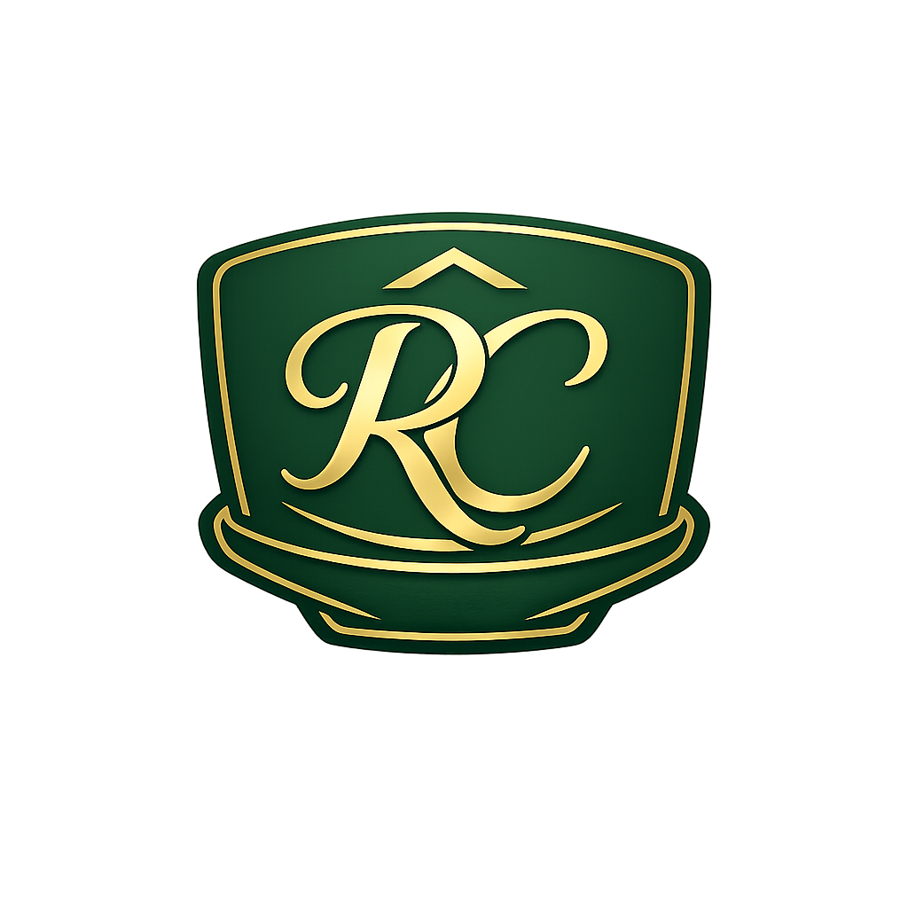

# ☕ Ralph’s Coffee — Luxury Café Website

<p align="center">
  <b>✨ Premium Café Experience • Modern UI • Fully Responsive ✨</b>
</p>

<p align="center">
  
</p>

<p align="center">
  
  
  
  
</p>

---

## 🎯 Project Overview

**Ralph’s Coffee** is a modern luxury café website built to simulate a real-world premium coffee brand.

The project focuses on:

* Elegant user interface
* Smooth user experience
* Mobile-first responsiveness
* Real business feel

It was developed as part of the **Future Interns — Full Stack Web Development Task 3 (2026)**.

---

## ✨ Features

### 🧭 Core Sections

* 🏠 Hero / Home section
* ☕ About the café
* 📋 Interactive Menu with filters
* 🖼️ Gallery with click-to-zoom lightbox
* ⭐ Auto-rotating customer reviews
* 📍 Contact section with Google Maps
* 📩 Contact form with validation

---

### 🎨 Premium UI Enhancements

* ✅ Sticky glassmorphism navbar
* ✅ Active nav highlight on scroll
* ✅ Smooth scrolling navigation
* ✅ Floating WhatsApp button
* ✅ WhatsApp quick order buttons
* ✅ Dynamic current year footer
* ✅ Mobile hamburger menu

---

## 🛠️ Tech Stack

| Technology  | Purpose          |
| ----------- | ---------------- |
| HTML5       | Structure        |
| CSS3        | Styling & Layout |
| JavaScript  | Interactivity    |
| Google Maps | Location embed   |

---

## 📱 Responsive Design

Fully optimized for:

* 💻 Desktop
* 📱 Mobile
* 📲 Tablet

---

## 📂 Project Structure

```
project/
├── index.html
├── style.css
├── script.js
└── assets/
    ├── logo.png
    ├── images...
```

---

## ⚙️ Run Locally

```bash
git clone https://github.com/ummeruhi/FUTURE_FS_03.git
cd FUTURE_FS_03
```

Then open **index.html** in your browser.

✅ No build tools required
✅ Pure frontend project

---

## 📲 WhatsApp Setup

Update your number in **script.js**:

```js
const WHATSAPP_NUMBER = "91XXXXXXXXXX";
```

---

## 🌟 What Makes This Project Stand Out

* Premium luxury café theme
* Real-business UI feel
* Clean and maintainable code
* Strong responsive behavior
* Interactive user experience
* Internship-ready quality

---


## 🚀 Future Improvements

* 🛒 Online ordering system
* 🔐 Admin dashboard
* 💳 Payment integration
* 🌙 Dark/light mode toggle
* 🧠 Backend integration

---

## ⭐ Support

If you like this project:

* ⭐ Star the repo
* 🍴 Fork it
* 🛠️ Build your own version

---

<p align="center">
  <b>☕ Crafted with passion for great coffee experiences</b>
</p>
